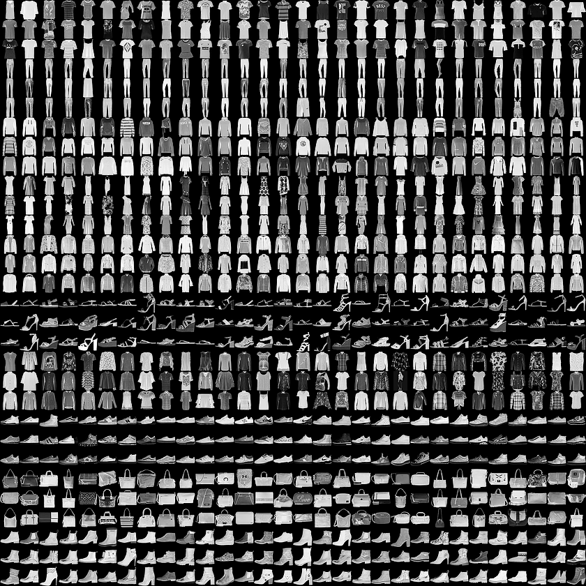
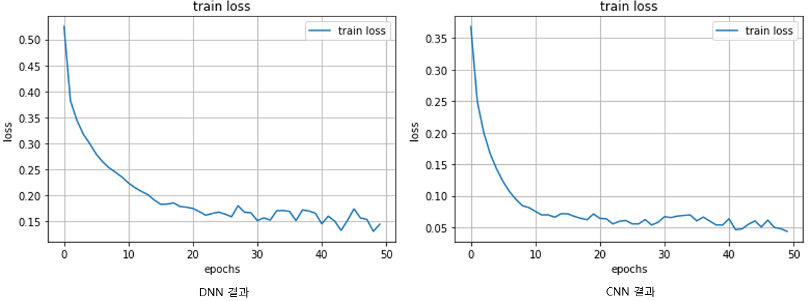
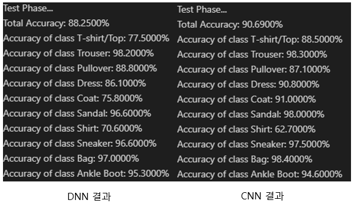

# Fashion MNIST 데이터셋을 활용한 분류 모델 구현
**고준규**

아래 포스팅의 실습 자료입니다.
[DNN을 사용한 Fashion MNIST 분류모델 생성](https://jungyuko.tistory.com/2)
[CNN을 사용한 Fashion MNIST 분류모델 생성](https://jungyuko.tistory.com/3)

---
## Task
* Fashion MNIST 데이터셋을 이용하여 분류모델을 생성해본다.
* DNN과 CNN으로 구성해보고 차이를 살펴본다.

## Dataset

* Fashion MNIST 데이터셋은 티셔츠, 샌들, 가방과 같은 10가지의 카테고리의 이미지들의 모음
* **자료구조**
    * [T-Shirts, Trouser, Pullover, Dress, Coat, Sandal, Shirt, Sneaker, Bag, Ankle boot]와 같이 10가지의 카테고리로 구성
    * 한 장의 이미지는 28x28 픽셀의 이미지로 이루어져 있으며, train 데이터로 60,000장, test 데이터로 10,000장

## Model
1. **DNN**
    * DNN (Deep Neural Network)
    * 여러개의 Linear Layer를 쌓아 Deep Neural Layer를 구성
    * Activation Function (ReLU)를 Layer마다 통과시켜줘야함 (신경망에 깊은 층을 쌓는 의미를 주는 효과)

2. **CNN**
    * CNN (Convolutional Neural Network)
    * 원본 이미지에 Filter를 통과시켜 Feature Map을 생성
    * kernel size=3, stride=1, padding=1로 설정하면 원본 이미지의 크기를 출력 결과로 얻을 수 있음
    * Channel의 수가 점점 깊어짐으로 분류를 위한 신경망으로써 의미가 있음
    * Pooling을 적용시켜서 이미지의 크기를 절반으로 축소 (Max Pooling, Avg Pooling)
    * 마지막으로 Linear Layer를 통과하여 분류모델을 구성 

3. **Loss**
    * 분류를 위한 문제에서는 Cross Entropy Loss를 사용하는 것이 일반적임

## Result

* 왼쪽의 이미지: DNN의 Loss 결과  
  오른쪽의 이미지: CNN의 Loss 결과 
* CNN이 loss가 더 낮게 떨어지는 것을 확인할 수 있다.

* 왼쪽 이미지: test 데이터에 대한 DNN accuarcy 결과  
  오른쪽 이미지: test 데이터에 대한 CNN accuracy 결과
* CNN으로 생성한 결과가 약 2%정도 높은 정확도를 얻는 것을 알 수 있다.
* DNN의 분류 모델은 T-Shirt, Coat, Shirt의 카테고리에 대해 정확도가 낮은 것을 확인할 수 있으며,  
  CNN의 분류 모델은 Shirt의 카테고리에 대해 정확도가 낮은 것을 확인할 수 있다.

---
## 마무리
* 간단한 신경망을 설계하여 적용시켜도 분류 모델로써 좋은 성능을 보이는 것을 확인할 수 있다.
